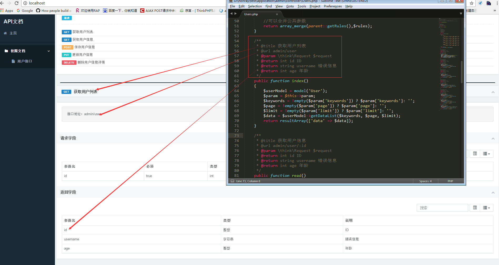
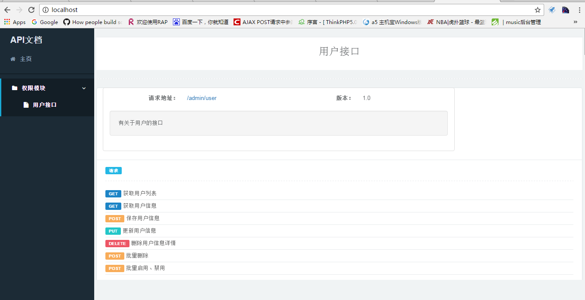
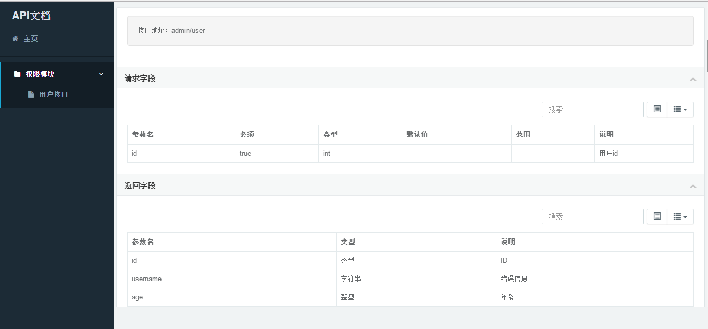

# honray-apilib
洪睿注释自动生成api文档模块

## 说明

根据TP5的资源路由restful风格，自动生成文档等功能；

 - restful风格处理请求
 > 每个接口对于一个控制器，method对应[method]Response方法响应
 
 - 文档生成
 > 简洁，优雅，不需要额外的文档工具;

 ## 相关依赖
 - [PHP5.4+]()
 - [ThinkPHP5.0.x](https://github.com/top-think/think) 基础框架
 - [Hadmin](https://git.oschina.net/liushoukun/hadmin.git) hAdmin是一个免费的后台管理模版,该模版基于bootstrap与jQuery制作，集成了众多常用插件，基本满足日常后台需要,修改时可根据自身需求;

 ## 目录结构


~~~
apilib
├─application           应用目录
│  ├─apilib             apilib目录
│  │  ├─Common.php      公共类库基础Rest
│  │  ├─BaseDoc.php     文档生成展示
│  │  ├─Behavior.php    行为类
│  │  └─ ...            

~~~

## 使用

 1. 新建admin 模块
 2. 创建Doc文档显示控制器,并添加如下方法

 ```php
    /**
     * 获取文档
     * @return mixed
     */
    public static function getApiDocList()
    {

    }
```
 3. 配置文件增加如下配置

 ```php
// 默认控制器名
'default_controller'     => 'Doc',
// 默认操作名
'default_action'         => 'apiList', 
'api_doc' => [
    '1' => ['name' => '测试文档', 'id' => '1', 'parent' => '0', 'module' => '', 'controller' => '','readme' =>''],//下面有子列表为一级目录
    '2' => ['name' => '获取权限', 'id' => '2', 'parent' => '1', 'module' => '', 'controller' => '', 'readme' => '/doc/md/auth.md'],//没有接口的文档，加载markdown文档
    '3' => ['name' => '用户接口', 'id' => '3', 'parent' => '1', 'module' => 'admin', 'controller' => 'User', 'readme' => ''],//User接口文档
];
```

|参数|必须|备注|作用|
|:---:|:---:|:---:|:---:|
|name|true|接口列表名称|显示列表名称|
|id|true|主键|生成列表所用|
|parent|true|生成列表所用|
|module|true|模块名|用于生成具体接口文档|
|controller|true|用于生成具体接口文档|

#### 控制器注释
1，控制器类头加上如下注释
```php
/**
 * Class User
 * @title 用户接口
 * @url /v1/user
 * @desc  有关于用户的接口
 * @version 1.0
 */
class User extends Common{}
```


|参数|必须|备注|作用|
|:---:|:---:|:---:|:---:|
|title|true|接口标题|显示列表名称|
|url|true|请求地址|用户显示|
|desc|true|接口描述|显示描述|


- 具体接口文档


2.接口描述信息(注释填写)
 
 
```php
   /**
    * @title 获取用户信息
	* @url admin/user
	* @method get
    */
  public function index(){}

```

|参数|必须|备注|作用|
|:---:|:---:|:---:|:---:|
|title|true|接口标题|显示列表名称|
|url|true|访问接口|显示链接地址|
|method|true|请求方法|get，post，put，delete|


   2.请求参数，在类定义方法。
   
   
```php
    /**
     * 参数规则
     * @name 字段名称
     * @type 类型
     * @require 是否必须
     * @default 默认值
     * @desc 说明
     * @range 范围
     * @return array
     */
    public static function getRules()
    {
        $rules = [
                //共用参数
                'all'=>[
                    'time'=> ['name' => 'time', 'type' => 'int', 'require' => 'true', 'default' => '', 'desc' => '时间戳', 'range' => '',]
                ],

                'index'=>[
                    'id' => ['name' => 'id', 'type' => 'int', 'require' => 'true', 'default' => '', 'desc' => '用户id', 'range' => '',]
                ],
                'read'=>[
                    'username' => ['name' => 'username', 'type' => 'string', 'require' => 'true', 'default' => '', 'desc' => '用户名', 'range' => '',],
                    'age' => ['name' => 'age', 'type' => 'int', 'require' => 'true', 'default' => '18', 'desc' => '年龄', 'range' => '0-200',],
                ]
        ];
        //合并父级类参数
        return array_merge(parent::getRules(),$rules);
    }
```

   3. 返回参数(注释填写)
   
   
```php
     * @return int id ID
     * @return string username 错误信息
     * @return int age 年龄
```


|参数|必须|备注|
|:---:|:---:|:---:|
|第一个参数|true|类型|
|第二个参数|true|参数名|
|第三个参数|true|参数说明|


>类型填写规则


```php
'string'    => '字符串',
'int'       => '整型',
'float'     => '浮点型',
'boolean'   => '布尔型',
'date'      => '日期',
'array'     => '数组',
'fixed'     => '固定值',
'enum'      => '枚举类型',
'object'    => '对象',
```


